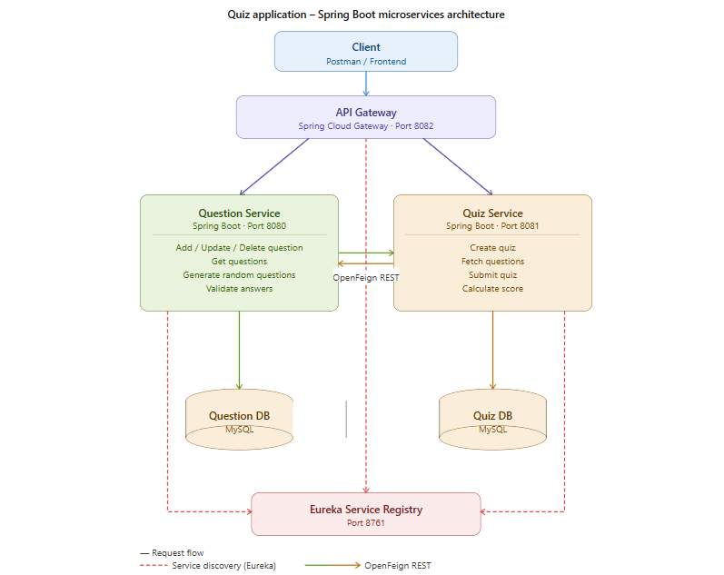
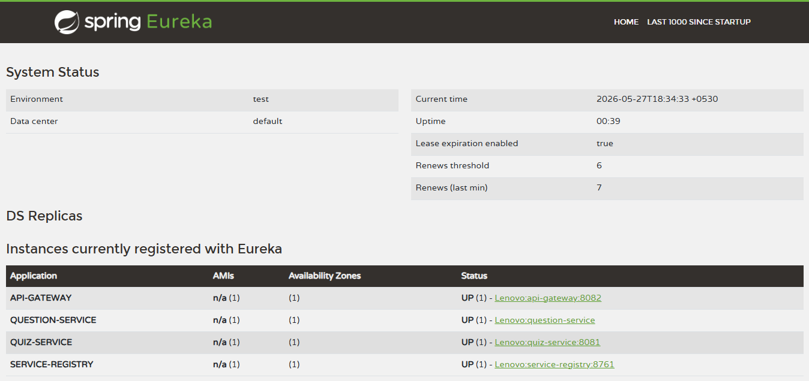
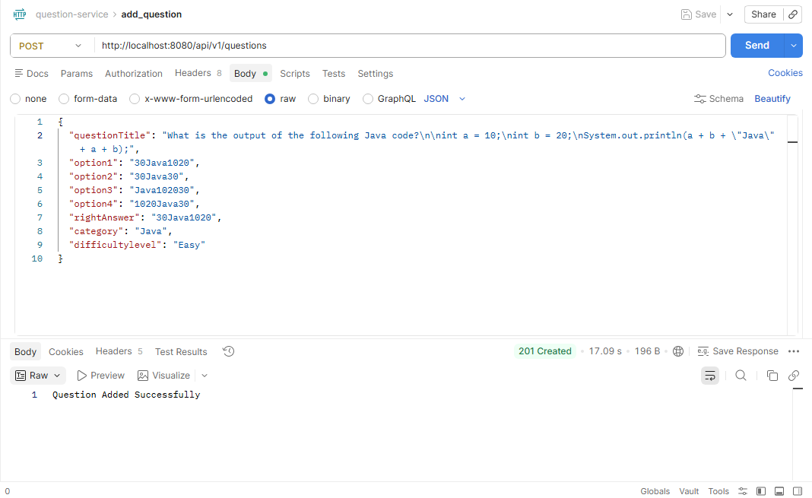
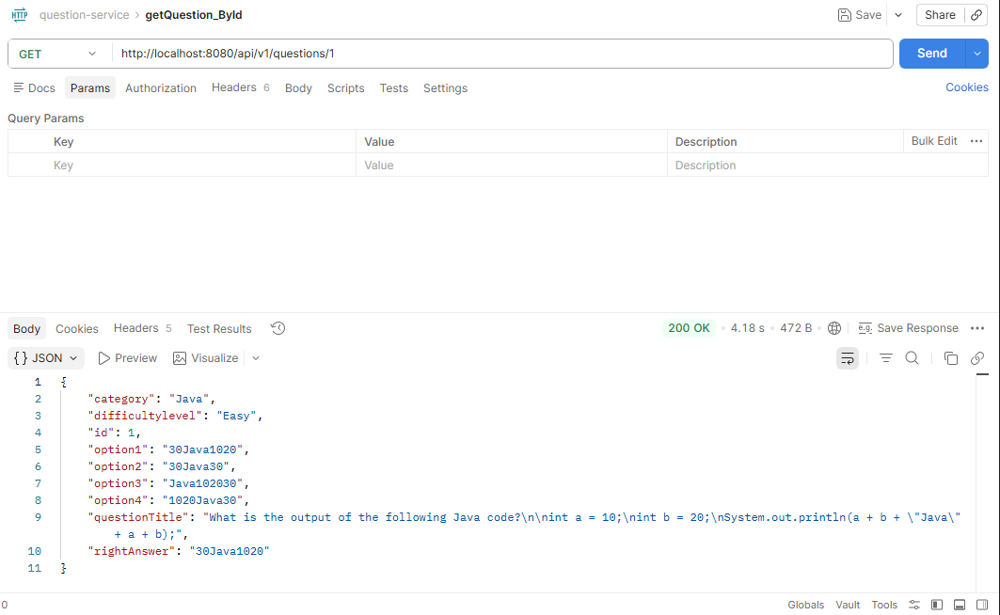
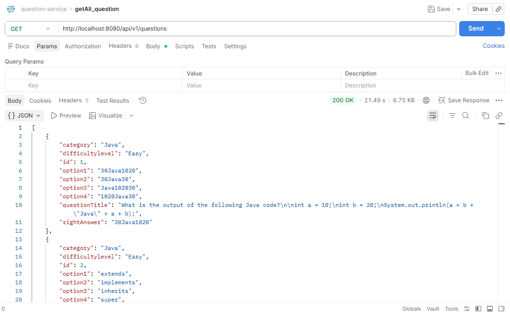
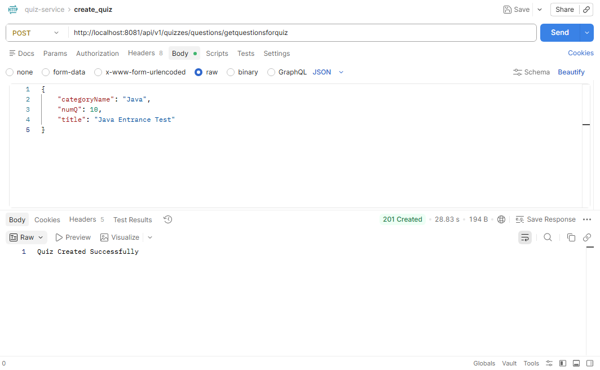
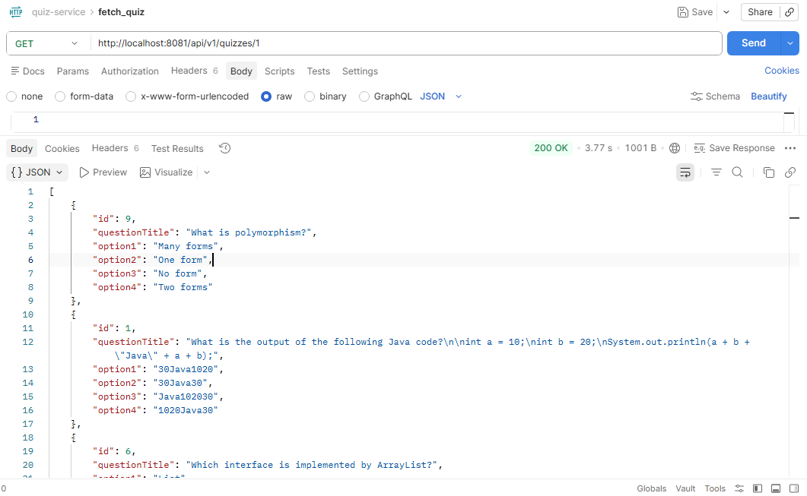
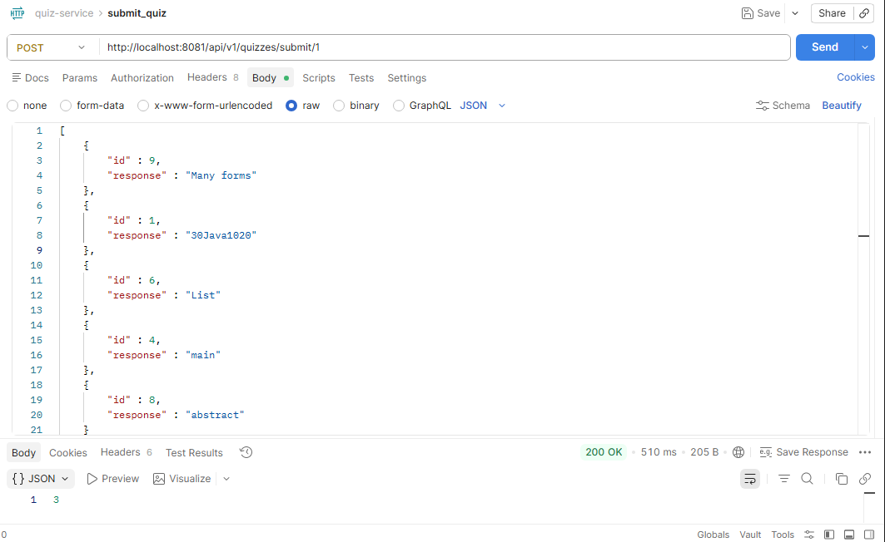
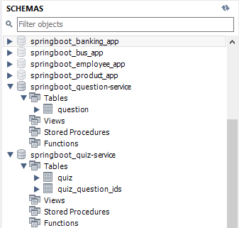
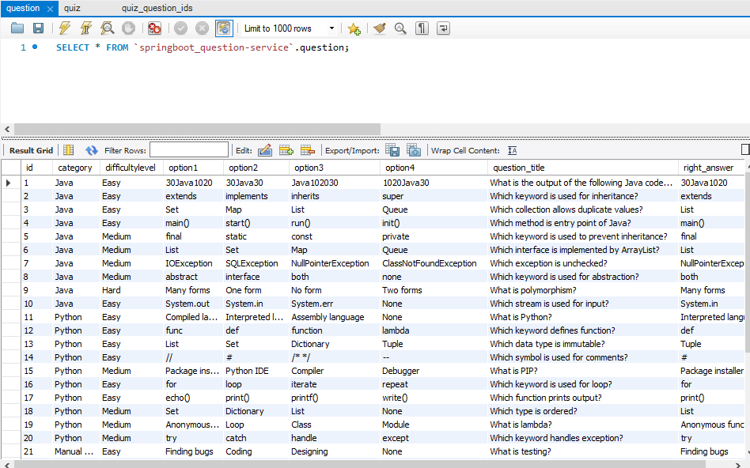

# Quiz Application - Spring Boot Microservices

A backend Quiz Application built using **Spring Boot Microservices Architecture** demonstrating service discovery, API Gateway routing, inter-service communication using OpenFeign, and database-per-service design.

---

## Project Overview

This project is designed to implement a scalable microservices-based quiz system.

It consists of four independent services:

- Question Service
- Quiz Service
- API Gateway
- Eureka Service Registry

Each microservice manages its own dedicated database to maintain loose coupling and scalability.

---

## Architecture Diagram

---

## Tech Stack

- Java
- Spring Boot
- Spring Cloud
- Eureka Server
- Spring Cloud Gateway
- OpenFeign
- Spring Data JPA
- Hibernate
- MySQL
- Maven
- REST APIs

---

## Microservices

### Question Service

Responsible for:

- Add Question
- Update Question
- Delete Question
- Fetch Questions
- Generate Random Quiz Questions
- Validate Submitted Answers

---

### Quiz Service

Responsible for:

- Create Quiz
- Retrieve Quiz Questions
- Submit Quiz
- Calculate Quiz Score

---

### API Gateway

Acts as the centralized routing layer for all client requests.

---

### Eureka Service Registry

Provides dynamic registration and discovery for all services.

---

## Service Communication

Inter-service communication is implemented using **OpenFeign Client**.

Quiz Service communicates with Question Service to:

- Fetch questions
- Validate submitted answers
- Calculate scores

---

## Database Architecture

Database-per-service pattern:

- Question Service → Question Database
- Quiz Service → Quiz Database

---

## Screenshots

### Eureka Dashboard

### Add Question

### Get Questions

### Get All Questions

### Create Quiz

### Fetch Quiz

### Submit Quiz

### Database Overview

### Question Table

---

## Ports Configuration

| Service | Port |
|--------|------|
| Eureka Server | 8761 |
| API Gateway | 8082 |
| Question Service | 8080 |
| Quiz Service | 8081 |

---

## Key Concepts Implemented

- Microservices Architecture
- Service Discovery
- API Gateway Routing
- OpenFeign Communication
- Database Per Service
- RESTful APIs
- Score Evaluation Logic

---

## Learning Outcomes

Through this project, I strengthened my understanding of:

- Distributed backend systems
- Spring Cloud ecosystem
- Inter-service communication
- Microservices design principles

---

## Future Enhancements

- Docker Containerization
- Circuit Breaker
- Authentication & Authorization
- Config Server
- Monitoring

---

## Author

Murugesan S

Aspiring Java Backend Developer
